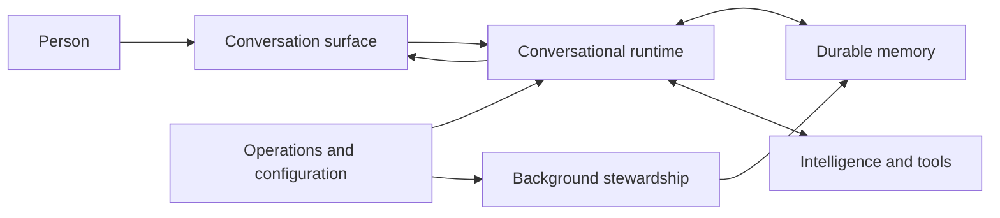
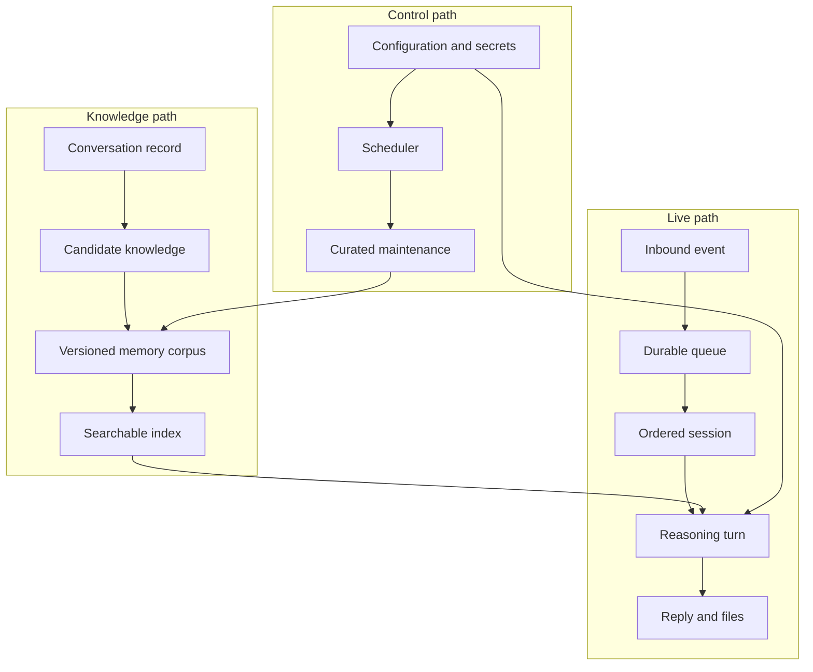

## Hero Visual

## Abstract

Siatt is a long-running conversational assistant built around deliberate memory. It receives messages from human-facing surfaces, answers through a provider-independent reasoning loop, retains immediate conversation state locally, and curates durable knowledge as human-readable documents in a private repository.

## Introduction

Most assistants treat each conversation as disposable context. Siatt instead treats continuity as a system property: messages survive restarts, relevant memories return on later turns, and durable beliefs remain inspectable and reversible by a person. The system combines live conversation, model-backed reasoning, safe external tools, scheduled work, and operational safeguards without hiding its memory behind an opaque service.

## Related Work

- [Conversational Runtime](./conversational-runtime/README.md) explains how one message becomes one ordered, tool-capable answer.
- [Durable Memory](./durable-memory/README.md) covers the path from conversation history to searchable, auditable knowledge.
- [Background Stewardship](./background-stewardship/README.md) describes the recurring work that curates memory and runs standing tasks.
- [Communication Surfaces](./communication-surfaces/README.md) shows how terminal and chat interactions enter and leave the system.
- [Intelligence and Tools](./intelligence-and-tools/README.md) explains model selection, context budgeting, search, page reading, and image generation.
- [Operations and Configuration](./operations-and-configuration/README.md) covers setup, secrets, health checks, and operator controls.

## Description

Siatt separates durable facts from transient execution. A local transactional store is the hot buffer for messages, work queues, schedules, usage, and search indexes. A private version-controlled corpus is the source of truth for long-term memory. The conversational runtime combines recent dialogue with selected memories, asks an appropriate model for the next step, executes bounded tools when needed, and returns the result through the originating surface.

The architecture favors explicit boundaries. Surfaces normalize outside events before they reach the core. Provider adapters hide protocol differences behind one conversation contract. Untrusted web material is labeled and isolated. Memory changes pass through typed validation before they become commits. Scheduled work is leased durably so a restart delays work instead of forgetting it.

## Conclusion

Siatt is best understood as a conversation service whose defining capability is maintained memory. Its surfaces, reasoning tools, background jobs, and operational controls all support that loop: listen reliably, answer usefully, remember selectively, and keep every durable belief open to human inspection.
