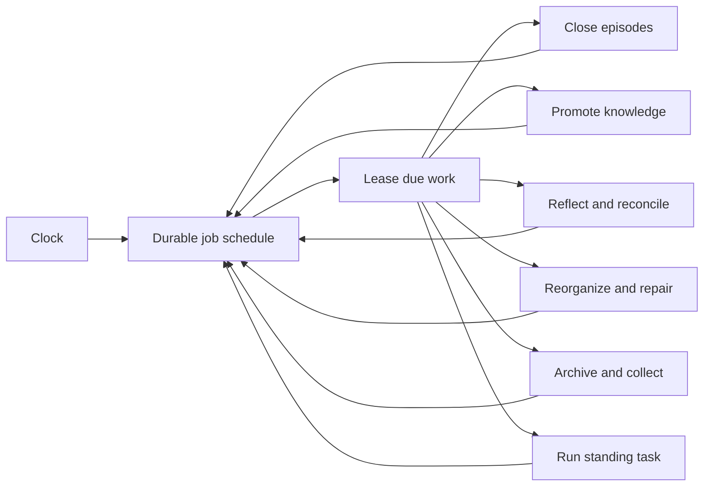
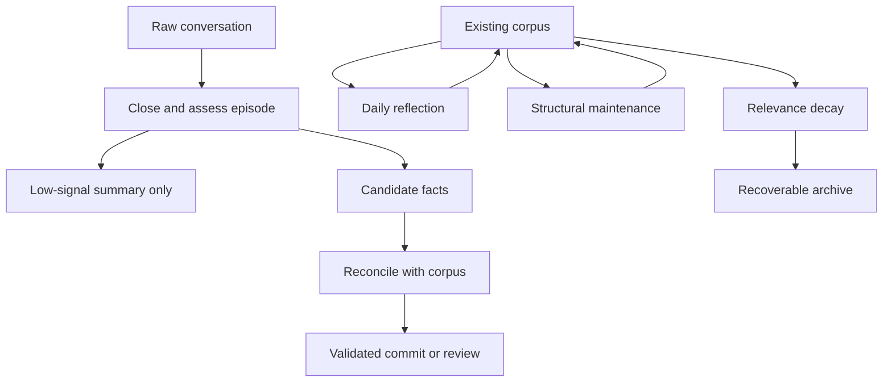

## Hero Visual

## Abstract

Background stewardship is the durable maintenance loop that turns conversation into curated memory, keeps the corpus healthy, and fires user-created standing tasks. Work is scheduled and leased through persistent records so restarts do not erase what was due or what was in progress.

## Introduction

Long-running assistants accumulate obligations beyond the current reply. Quiet conversations need summarizing, candidate facts need reconciliation, stale knowledge needs review, search indexes need refreshing, and scheduled requests need to fire at the right destination. Siatt treats all of these as durable jobs with explicit retry and failure behavior rather than incidental timers.

## Related Work

- [Siatt](../README.md) shows how stewardship closes the system’s memory loop.
- [Durable Memory](../durable-memory/README.md) is the corpus and hot state that maintenance jobs transform.
- [Conversational Runtime](../conversational-runtime/README.md) shares the durable work-draining machinery and handles task-generated turns.
- [Communication Surfaces](../communication-surfaces/README.md) delivers standing-task results and operational notifications.
- [Operations and Configuration](../operations-and-configuration/README.md) exposes job status, manual runs, retries, and scheduling controls.

## Description

The scheduler stores definitions and next-run times in the database. When work becomes due, workers lease bounded batches, renew leases while active, and record success or failure. A crashed worker leaves reclaimable work rather than an invisible gap. Repeated transient failures back off; exhausted work becomes visible for operator intervention.

Each built-in job has a focused role. Episode closing summarizes inactive or long threads and extracts worthwhile observations. Promotion reconciles those observations with existing beliefs. Reflection writes journals, adjusts relevance, applies feedback, and surfaces contradictions. Reorganization merges duplication, splits oversized topics, repairs links, and refreshes navigation. Forgetting archives knowledge that no longer earns attention and later collects unreferenced media after a grace period. Identity maintenance connects external participants to stable person memories, while reindexing keeps derived search state aligned with the corpus.

Standing tasks reuse the same scheduler but remain user data rather than product maintenance. Each occurrence becomes a normal conversational turn in the place where the schedule was created, preserving memory, tools, visibility, and reply behavior.

## Conclusion

Stewardship lets Siatt improve and act between messages without relying on ephemeral timers. Durable scheduling, bounded leases, specialized maintenance passes, and visible failure states make autonomous work recoverable and accountable.
