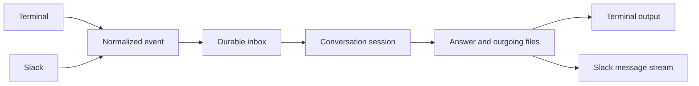
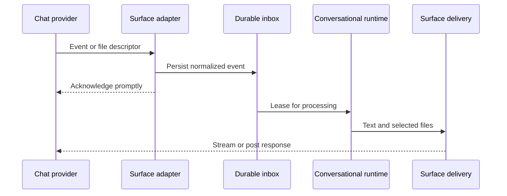

## Hero Visual

## Abstract

Communication surfaces connect Siatt to people without leaking provider-specific event shapes into the conversational core. Terminal and Slack interactions become the same normalized event, pass through a durable inbox, and return through surface-aware delivery that handles streaming, limits, identity, and files.

## Introduction

Chat providers impose different timing, threading, formatting, and attachment rules. If those rules enter the agent loop, every new surface complicates reasoning and persistence. Siatt keeps the boundary narrow: adapters decide whether an event belongs to the assistant, normalize it, enqueue it durably, and acknowledge the provider before expensive work begins.

## Related Work

- [Siatt](../README.md) shows surfaces as the human edge of the architecture.
- [Conversational Runtime](../conversational-runtime/README.md) processes the normalized events that surfaces produce.
- [Durable Memory](../durable-memory/README.md) retains conversations, participant links, and attachment references across surfaces.
- [Background Stewardship](../background-stewardship/README.md) sends task results and maintenance notifications through configured destinations.
- [Intelligence and Tools](../intelligence-and-tools/README.md) determines whether a surface can carry images or generated files during a turn.

## Description

Every inbound interaction is converted into a provider-neutral record containing its source, stable external identity, conversation scope, author, text, timing, and attachment descriptors. The inbox deduplicates provider retries and allows acknowledgement to happen independently from reasoning. A session router then groups events by conversation and ensures ordered handling.

The terminal surface offers a direct interactive session with local commands and file output. The Slack surface adds mention and thread admission rules, per-channel boundaries, user identity mapping, edits, deletions, reactions, rate-aware message streaming, safe file download, and upload. Streaming coalesces intermediate text so live answers feel responsive without exhausting provider limits. File handling separates descriptors from bytes at ingress, verifies what arrives, and permits egress only when the active surface can actually deliver it.

## Conclusion

Surface adapters let Siatt remain one assistant across different conversation channels. Normalization keeps the core portable, durable enqueueing protects messages from slow turns and restarts, and surface-aware delivery makes threads, rate limits, reactions, and attachments explicit at the edge.
