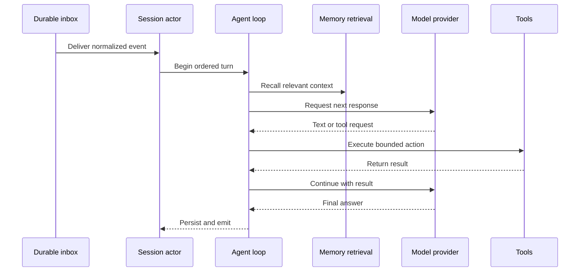
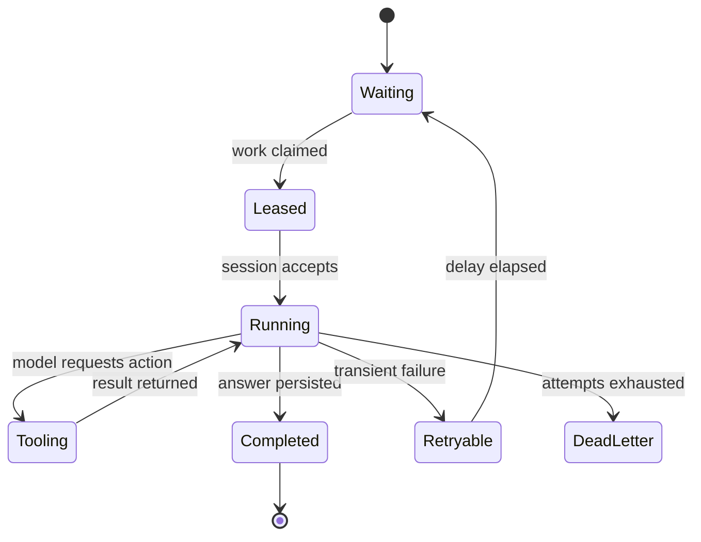

## Hero Visual

## Abstract

The conversational runtime turns durable inbound events into ordered, context-aware answers. It preserves per-conversation ordering while allowing unrelated conversations to proceed concurrently, and it supports iterative model-and-tool exchanges within a single turn.

## Introduction

A reliable chat agent has two competing needs: it must respond as a coherent participant inside one conversation, and it must remain available to many conversations at once. Siatt meets both by serializing work only within a session. It reconstructs state from durable storage at turn boundaries, so process lifetime is never mistaken for conversation lifetime.

## Related Work

- [Siatt](../README.md) places the runtime inside the complete system.
- [Durable Memory](../durable-memory/README.md) provides the recalled knowledge and persistent conversation records used during a turn.
- [Communication Surfaces](../communication-surfaces/README.md) supplies normalized events and delivers completed answers.
- [Intelligence and Tools](../intelligence-and-tools/README.md) supplies model routing, context limits, and callable capabilities.
- [Background Stewardship](../background-stewardship/README.md) shares the durable leasing and supervision patterns used for asynchronous work.

## Description

An event first waits in a persistent inbox. A dispatcher leases it and routes it to the actor responsible for its conversation. That actor processes one item at a time, preventing overlapping turns from scrambling dialogue order. Because the actor reloads persisted state for each turn, idle actors can disappear safely and work can resume after a restart.

Before reasoning begins, the runtime assembles a bounded context from stable instructions, recent conversation, episode summaries, and retrieved memory. Each source receives its own allowance so a large retrieval cannot crowd out the current exchange. The model may produce an answer immediately or request tools; results are fed back into the same turn until a final response is ready. Messages, usage, supporting-memory references, and outgoing files are recorded so later feedback and follow-up turns remain grounded.

## Conclusion

The runtime’s central promise is ordered continuity without fragile in-memory state. Durable queues protect delivery, session actors protect conversational order, and bounded model-tool cycles turn recalled context into an answer that can be resumed, measured, and explained.
