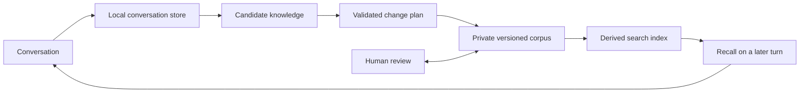
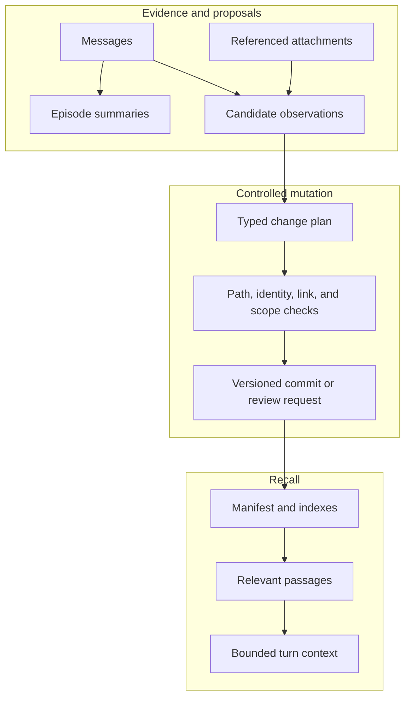

## Hero Visual

## Abstract

Durable memory gives Siatt continuity while keeping its beliefs legible and reversible. Recent dialogue and derived indexes live in a local database, while long-term knowledge lives as structured Markdown in a private version-controlled repository that a person can read, edit, and audit.

## Introduction

Remembering everything verbatim is neither useful nor safe. A conversational system needs to distinguish current dialogue from durable knowledge, retrieve only what matters, and remain correctable when its conclusions are wrong. Siatt makes the long-term corpus the authority and treats database indexes as disposable projections that can always be rebuilt.

## Related Work

- [Siatt](../README.md) explains why memory is the organizing principle of the system.
- [Conversational Runtime](../conversational-runtime/README.md) consumes recalled context and records new interactions.
- [Background Stewardship](../background-stewardship/README.md) promotes, reflects on, reorganizes, and forgets knowledge over time.
- [Intelligence and Tools](../intelligence-and-tools/README.md) covers the reasoning and retrieval interfaces that expose memory during a turn.
- [Operations and Configuration](../operations-and-configuration/README.md) sets up and verifies the private corpus and local stores.

## Description

Memory is divided by responsibility. The hot store holds transcripts, episode state, candidate observations, work queues, schedules, attachment metadata, and accounting. The durable corpus holds curated knowledge documents with stable identities, visibility, confidence, salience, links, and provenance. Search structures sit between them, providing fast lexical and optional semantic retrieval without becoming a second authority.

Interactive memory writes are proposals rather than direct edits. Background curation turns proposals into explicit create, update, merge, supersede, archive, or delete operations; deterministic validation rejects unsafe or inconsistent plans before any repository mutation. Retrieval combines query terms, date-aware phrasing, ranking signals, and document chunks, then returns a compact selection with a trace that can explain why each item was chosen. Attachments use content-addressed storage and scoped references so remembered media remains deduplicated without becoming globally guessable.

## Conclusion

Siatt remembers through a controlled knowledge lifecycle, not an ever-growing transcript. The local store makes conversation fast and recoverable; the private corpus makes durable beliefs human-auditable; and validated changes plus rebuildable indexes keep those two roles from drifting together.
