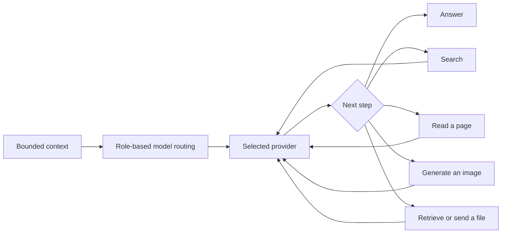
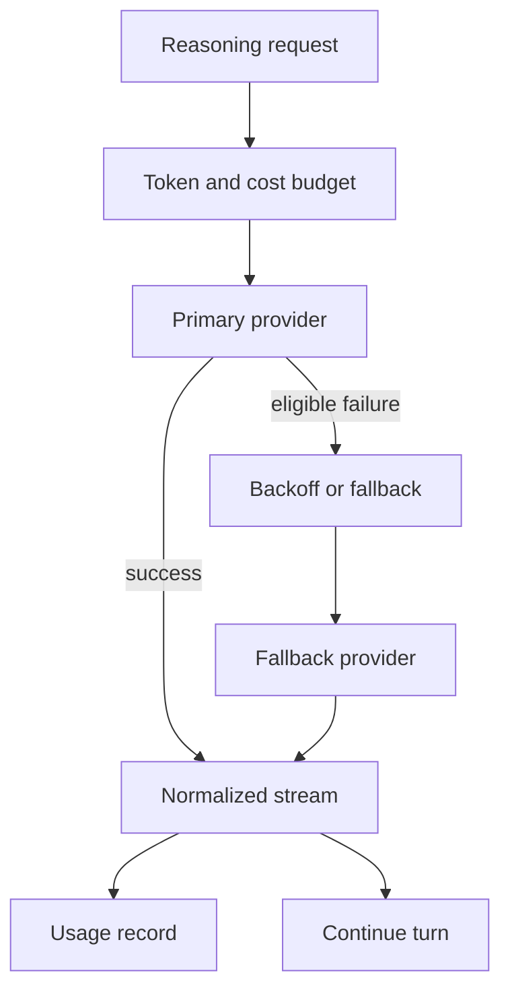

## Hero Visual

## Abstract

Intelligence and tools provide a common reasoning layer across model vendors and a bounded set of external capabilities. The feature selects providers by role, prepares token-aware multimodal context, meters cost, retries eligible failures, and exposes safe tools for memory, web information, files, schedules, and image generation.

## Introduction

An assistant cannot assume that one provider is best for every task or that all providers speak the same protocol. It also cannot safely hand a model unrestricted network or filesystem access. Siatt separates conversational intent from vendor transport and turns outside capabilities into explicit, validated tool contracts with budgets and provenance.

## Related Work

- [Siatt](../README.md) places intelligence within the end-to-end assistant loop.
- [Conversational Runtime](../conversational-runtime/README.md) orchestrates repeated model and tool exchanges.
- [Durable Memory](../durable-memory/README.md) supplies recalled knowledge and memory tools.
- [Communication Surfaces](../communication-surfaces/README.md) determines which media can enter a model context or leave with an answer.
- [Operations and Configuration](../operations-and-configuration/README.md) selects providers, credentials, prices, budgets, and optional capabilities.

## Description

Models are registered for conversational, utility, and embedding roles. Each role may have fallbacks, retry policy, image support, and pricing. Provider-specific streaming events are normalized into one response vocabulary, allowing the agent loop to handle text, reasoning, images, tool calls, and usage consistently. A cost meter records calls and enforces the configured daily ceiling before optional paid actions begin.

Context assembly reserves space separately for instructions, recent dialogue, summaries, retrieved memories, tool definitions, and images. Oversized material is reduced at meaningful boundaries, and images are resized or described according to the chosen model’s capabilities.

Tools stay narrow. Search returns structured snippets; page reading allows only public web destinations, rechecks redirects, limits bodies, and labels retrieved text as untrusted. Browser rendering is optional for script-built pages. Image generation records measured output, cost, and synthetic provenance before attaching it to the reply. Memory and file tools restrict references to known, scoped items, while schedule tools bind destinations to the current conversation rather than accepting arbitrary addresses.

## Conclusion

This capability makes reasoning portable and action constrained. Provider normalization, role-based routing, explicit budgets, and narrow tool contracts let Siatt use powerful models and external services without making any single vendor or model request the architectural center of the system.
