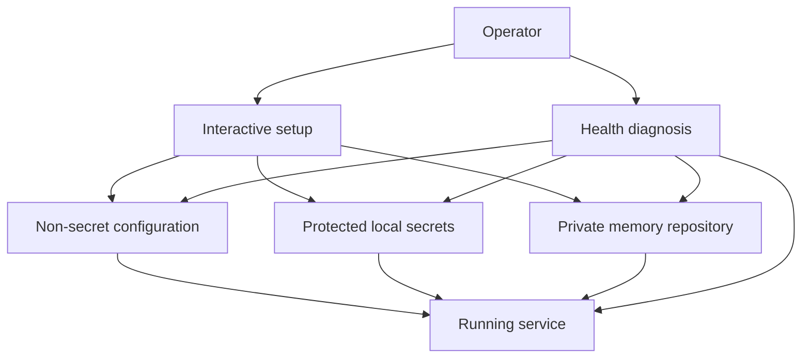
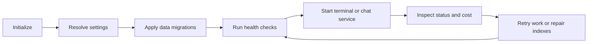

## Hero Visual

## Abstract

Operations and configuration turn Siatt from source code into a maintainable service. They guide first-time setup, keep secrets separate from declarative settings, verify privacy and runtime prerequisites, expose administrative commands, and make queues, jobs, schedules, costs, reviews, and indexes observable.

## Introduction

A persistent assistant depends on more than a valid model key. Its memory repository must remain private, local paths must resolve predictably, schema changes must be applied, optional capabilities must match installed dependencies, and failed durable work must be visible. Siatt centralizes these concerns in an operator-facing command surface and a typed configuration model.

## Related Work

- [Siatt](../README.md) provides the full system context for operational controls.
- [Durable Memory](../durable-memory/README.md) depends on setup, privacy validation, migrations, indexing, and repository access.
- [Background Stewardship](../background-stewardship/README.md) exposes job and standing-task state to operators.
- [Communication Surfaces](../communication-surfaces/README.md) receives its Slack and terminal settings from configuration.
- [Intelligence and Tools](../intelligence-and-tools/README.md) consumes provider, search, browser, image, price, and budget settings.

## Description

Interactive setup discovers or creates the private long-term-memory repository, prepares a local clone, configures model roles and optional integrations, and writes a non-secret settings file. Secret values are named by configuration but resolved from a protected local vault or the environment. This separation keeps credentials out of ordinary configuration displays and version control.

The health diagnosis checks the configuration file, executables, model credentials, optional search and browser support, attachment storage, database state, indexes, repository clone, and remote privacy. Startup repeats the most important privacy assertion so a repository that later becomes public is not silently used.

Administrative commands expose resolved configuration, secret management, spending, retrieval traces, database migrations, queue status, failed-work retries, job runs, standing-task lifecycle, review queues, and index rebuilding. The command surface favors explicit recovery: failures are inspected and retried, migrations move forward, and long-term-memory edits remain versioned rather than being repaired through hidden state.

## Conclusion

Operational tooling makes Siatt deployable without making its safety assumptions implicit. Typed settings, separated secrets, repeatable initialization, privacy checks, diagnostics, and visible recovery controls give an operator a clear account of what the assistant can access and whether its durable systems are healthy.
